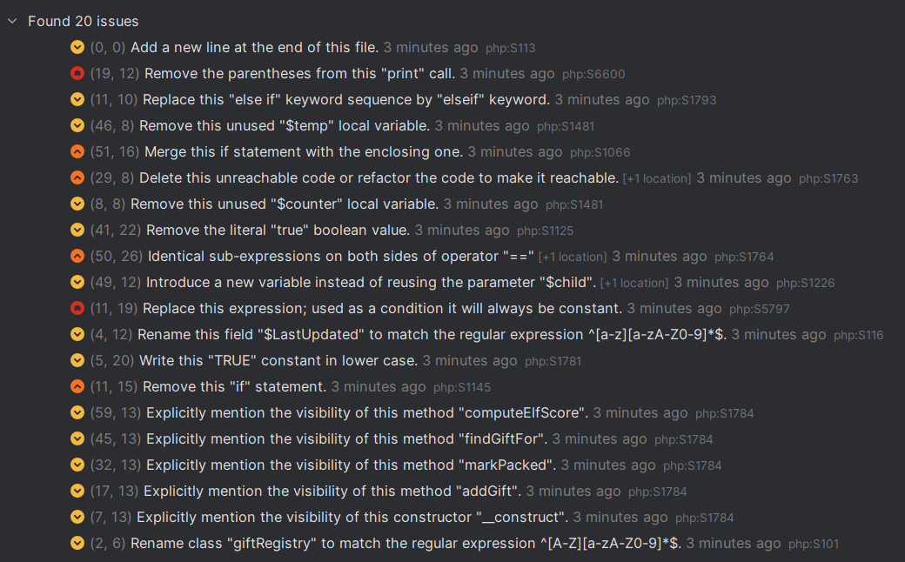

# Jour 7 - L'imparfait du futur

## Objectif

L'objectif du jour est d'évaluer un code avec un linter et de le rendre plus propre, cohérent et maintenable.

## Linter

J'ai choisi de travail sur le code PHP avec le linter SonarLint.

Lors de la première inspection, le linter a détecté 20 problèmes.



## Solution

En suivant les conseils du linter, voici mon code corrigé :

```php
<?php
class GiftRegistry {
    public $gifts = [];
    public $debug = true;

    public function __construct($initial = null) {
        if ($initial != null) {
            $this->gifts = $initial;
        }
    }

    public function addGift($child, $gift, $packed = null) {
        if ($child == "") {
            print "child missing\n";
        }
        foreach ($this->gifts as $g) {
            if ($g['childName'] == $child
                && $g['giftName'] == $gift) {
                    return;
            }
        }
        $this->gifts[] = ['childName'=>$child,'giftName'=>$gift,'isPacked'=>$packed,'notes'=>"ok"];
    }

    public function markPacked($child) {
        $found = false;
        for ($i=0; $i<count($this->gifts); $i++) {
            $g = $this->gifts[$i];
            if ($g['childName'] == $child) {
                $this->gifts[$i]['isPacked'] = true;
                $found = true; break;
            }
        }
        if ($found) { return true; }
        return false;
    }

    public function findGiftFor($child) {
        $result = null;
        foreach ($this->gifts as $g) {
            $childName = $g['childName'];
            if ($child == $childName
                && $g['childName'] == func_get_arg(0)) {
                    $result = $g;
            }
        }
        return $result;
    }

    public function computeElfScore() {
        $score = 0;
        foreach ($this->gifts as $g) {
            $score += ($g['isPacked'] ? 7 : 3) + (!empty($g['notes']) ? 1 : 0) + 42;
        }
        if ($this->debug) { echo "score: ".$score.PHP_EOL; }
        return $score;
    }
}

```