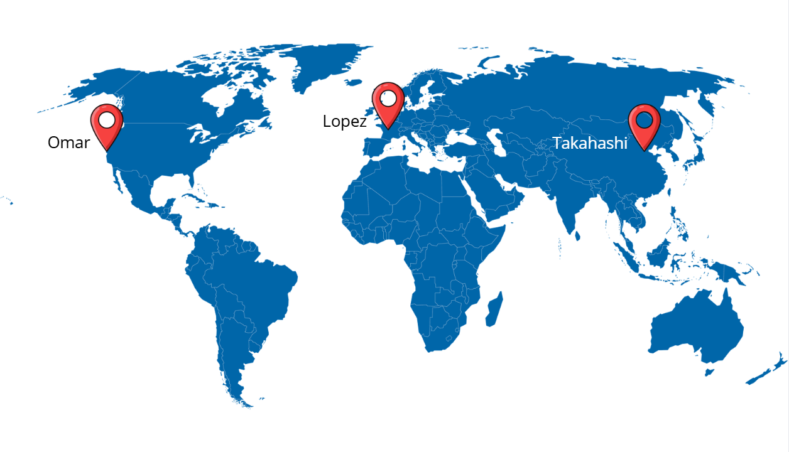

# Jour 8 - Les 3 enfants les plus sages

L'objectif du jour est d'identifier les enfants les plus sages et de trouver leur localisation.

## Installation d'un manager de base de donnée

J'ai installé DBeaver et ai importé notre fichier `kids.db`.

## Requète SQL

Je peux alors faire ma requète SQL pour récupérer les informations des trois enfants les plus sages :

```sql
SELECT
	b.nice_score,
	c.first_name,
	c.last_name,
	p.x_m AS coordonnee_x,
	p.y_m AS coordonnee_y
FROM children c
INNER JOIN behavior b ON b.child_id = c.id
INNER JOIN elf_plan p ON p.child_id = c.id
WHERE b."year" = 2025
ORDER BY b.nice_score DESC
LIMIT 3;
```

> Remarque : Je me rend alors compte, en modifiant la limite, que 38 enfants ont un score de 100.

J'utilise donc la requète suivante :

```sql
SELECT
	b.nice_score,
	c.first_name,
	c.last_name,
	p.x_m AS coordonnee_x,
	p.y_m AS coordonnee_y
FROM children c
INNER JOIN behavior b ON b.child_id = c.id
INNER JOIN elf_plan p ON p.child_id = c.id 
WHERE b."year" = 2025
ORDER BY b.nice_score DESC
LIMIT 38;
```

Résultat de la requète :

|nice_score|first_name|last_name|coordonnee_x       |coordonnee_y       |
| -------- | -------- | ------- | ----------------- | ----------------- |
|     100.0|Freya     |Naidoo   | 239844.87963161472|  5066983.475842562|
|     100.0|Mia       |Rossi    | 243627.45042345746|  5071393.973732535|
|     100.0|Isha      |Takahashi|  12956655.56562792|   4853110.98622232|
|     100.0|Chloe     |Takahashi| 12960429.139253259|  4849601.187168247|
|     100.0|Isha      |Fernandez|  8639876.353982782| 1457031.1668874267|
|     100.0|Jie       |Patel    |  8636880.324938808|  1457977.898664714|
|     100.0|Naledi    |Khan     | -6498132.794854322| -4112392.644907251|
|     100.0|Maya      |Khan     | -6499547.595827959| -4107628.437423869|
|     100.0|Nina      |Johnson  |   8594843.49384394| 3328568.9091422614|
|     100.0|Chen      |Bernard  |  8593702.665679762|  3328240.229803229|
|     100.0|Lars      |Bianchi  |  540170.9660111787|  5739627.720257829|
|     100.0|Chen      |Alvarez  |-11035998.971443217| 2207968.7063487503|
|     100.0|Lucia     |Olsen    |-11034869.451472223|  2208228.997162712|
|     100.0|Lucas     |Johansson| -8239270.227698607|  4971284.223853441|
|     100.0|Isha      |Patel    | -8239464.015734824| 4967738.8042108435|
|     100.0|Sophia    |Costa    | -8237022.589212742| 4971453.4878710555|
|     100.0|Sophia    |Johnson  | 15082131.642338062| 4122497.7609999576|
|     100.0|Nina      |Cohen    | 15082300.588960992| 4121559.2768834857|
|     100.0|Chloe     |Fernandez| 15083980.679098733| 4122186.9640338565|
|     100.0|Layla     |Garcia   | 1194868.9792825626|  8378353.527188489|
|     100.0|Sofia     |Martin   | 1197796.5681783976|  8379270.033971759|
|     100.0|Astrid    |Lopez    |  263850.2181406793|  6253825.689159202|
|     100.0|Emma      |Smith    | 260150.06067183035|  6250224.947417501|
|     100.0|Thabo     |Wang     | -4805410.987618822|-2619546.6065878547|
|     100.0|Lucia     |Zhang    | -4805249.713438436|  -2621276.48738899|
|     100.0|Diego     |Bernard  |-4807860.0012734365| -2621077.166369154|
|     100.0|Haruto    |Romero   | -4807738.979870086| -2618779.408750478|
|     100.0|Omar      |Costa    |-13626856.045782633|  4549885.722212345|
|     100.0|Olivia    |Zhang    |-13626204.938022649|  4548274.876227443|
|     100.0|Freya     |Martinez | 13523025.262596587| 3661393.8017177163|
|     100.0|Ines      |Martin   |  13523735.00581812|  3664335.975601317|
|     100.0|Santiago  |Romero   | 2012576.0605027543|  8250747.134814068|
|     100.0|Haruto    |Alvarez  | 2012498.0955761224|  8254388.109589989|
|     100.0|Chen      |Dubois   | 15547784.960853145| 4256656.0918525355|
|     100.0|Lucia     |Singh    | 15546243.569035765|  4258307.157532488|
|     100.0|Santiago  |Silva    | 15547409.806059668|   4255946.87736987|
|     100.0|Noah      |Pereira  | -8836281.504870448|  5410771.233347062|
|     100.0|Zainab    |Lopez    | -8836774.120945282|   5413235.72060579|


## Visualisation sur une carte

Je convertis les coordoonées en format latitude/longitude.
Puis j'injecte la tableau sous format csv dans UMap.




Défi réussi !!